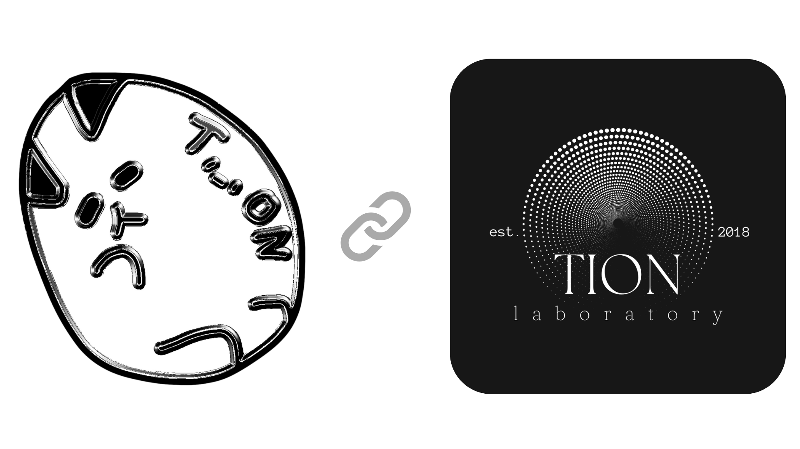

# ✨ Tion Software Laboratory (02) ✨

## 🔮Unleashing Power of Creation   자유로운 상상을 간단하지만 정교하게 현실화.

# Tation 타티온

   
  👨‍💻 웹/프로그램/서버 <strong>소프트웨어 개발자</strong>  & <strong>화이트햇(웹)</strong> 
  👨🏻‍🎓 <strong>2006년생</strong>, 만 18세 
  🏫 2024 인문계 고등학교 졸업, 2025 건국대학교 글로컬캠퍼스 컴퓨터공학과 수석 입학 (학생부종합전형) 
  🧪 Tionlabs 총괄, <a href="https://hci.kku.ac.kr/" target="_blank">KKU HCI Lab</a>
학부연구생

#### 사용 언어

> $\bf{\color{#7081ff}Python\ /\ Javascript\ /\ C\ /\ Go\ /\ Git}$

  
Click to expand

    <h3>Python</h3>
    Flask, Selenium, OpenCV, MediaPipe, Tkinter, PyQt, Tensorflow, Pandas, Scikit-learn, Pillow, Pygame, Ursina, MoviePy, SpeechRecognition, gTTS, Requests, tqdm, Dotenv, PyInstaller, Nukita and more.
    

    <h3>Javascript (Typescript)</h3>
    Node.js, React.js, ReactNative, Expo, Next.js, Tailwind CSS, MongoDB(mongoose), Firebase, Express.js, Discord.js(v13~14), Electron, Chart.js, Canvas.js, Axios, Dotenv and more.
    

    <h3>HTML, CSS, C, Arduino(C++), GO, Git, Markdown, RegEx and more.</h3>
    

 

#### 사용 툴 / OS

> $\bf{\color{#7081ff}Vscode\ /\ Docker\ /\ Npm\ /\ Bun\ /\ Ubuntu\ /\ RaspberryPi}$

  
Click to expand

    <h3>VSCode, Docker, Github, PyPI(pip), Anaconda, Npm, Bun</h3>
<h3>Bash, PowerShell</h3>
<h3>Ubuntu, RaspberryPi, Window 11</h3>
<h3>Heroku(BuildPack/Hosting), Netlify, Replit, Vercel, DigtalOcean, PuTTY</h3>
    
<h3>Blender, AfterEffect, PhotoShop, Notion and more.</h3>

 

#### 학습 중

> $\bf{\color{#70b3ff}Anaconda\ /\ Java\ /\ Kotlin\ /\ Rust}$

  
Click to expand

    <h3>Anaconda, Java, SpringBoot, Kotlin, C++, Rust and more.</h3>

 

#### 학습 예정 (배워보고 싶은것들)

> $\bf{\color{#70eeff}Ruby\ /\ Android\ Studio\ /\ Swift\ /\ Svelte\ /\ Flutter\ /\ Three.js\ /\ Unreal}$

<table align="center">
  <tr>
    <td align="center">
      
    </td>
    <td align="center">
      
    </td>
  </tr>
  <tr>
    <td align="center">
      
    </td>
    <td align="center">
      
    </td>
  </tr>
  <tr>
    <td align="center">
       
    </td>
    <td align="center">     
       
    </td>
  </tr>
</table>

  
   
  © 2025 tation & tionlab Est. 2018

